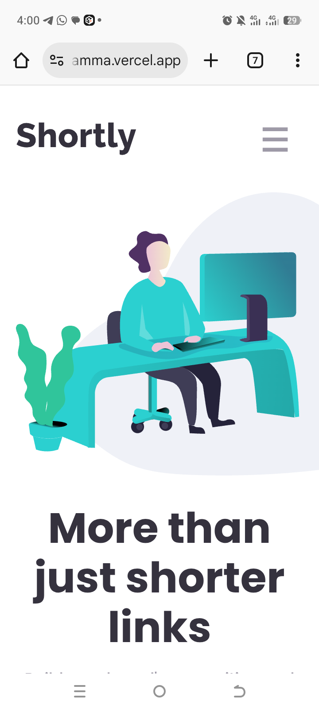
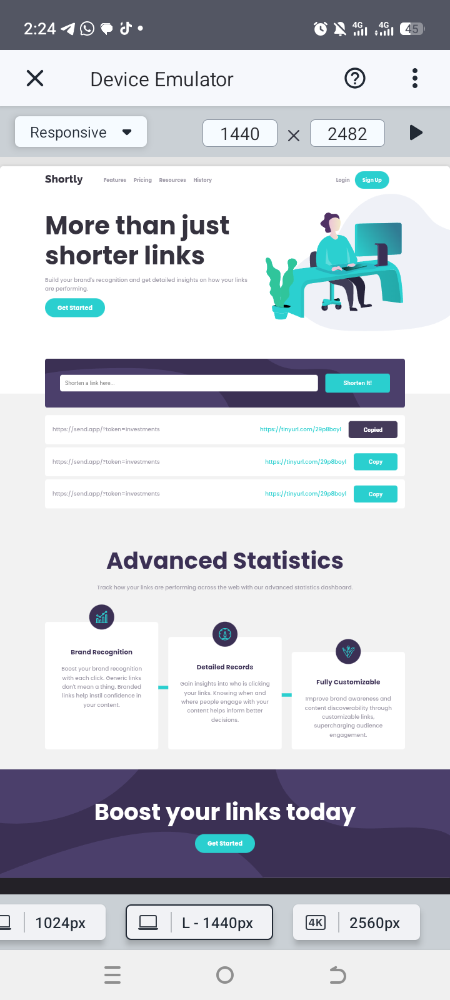

Frontend Mentor - Shortly URL Shortening API Challenge Solution

This is my solution to the Shortly URL Shortening API Challenge on Frontend Mentor. This challenge helped me practice responsive design, JavaScript API integration, and localStorage management.

Table of Contents

Overview 

The challenge

Added features 

Screenshot

Links

My process 

Built with

What I learned

Continued development

Useful resources

Author

Acknowledgments

Overview

The challenge

Users should be able to:

- View the optimal layout for the site depending on their device's screen size
- Shorten any valid URL
- See a list of their shortened links, even after refreshing the browser
- Copy the shortened link to their clipboard in a single click
- Receive an error message when the `form` is submitted if:
  - The `input` field is empty
  
Added features

I added a history page to store previously shortened links while only three recent ones are displayed on the main page (Click the history link)

Screenshot

‎
‎

Links

Solution URL: https://github.com/Mclakez/Url-shortener

Live Site URL: https://url-shortener-dusky-gamma.vercel.app/

My process

I started this project by reviewing the design and breaking it down into boxes such as the header, URL input form, and shortened links list. I built the layout using semantic HTML and used a mobile-first approach, then added styles for larger screens to make the site fully responsive.
After setting up the layout, I worked on the main functionality — shortening URLs. I connected the app to the TinyURL API using fetch() with async/await. I also added basic validation so the form shows an error message when the input field is empty.
I used localStorage to save shortened links. This allows users to still see their links even after refreshing the page. When the app loads, it reads the stored data and displays it automatically.
For the copy feature, I used the Clipboard API and implemented event delegation so copy buttons added dynamically would still work correctly.

Built with

HTML5, Semantic markup

CSS3 (Custom properties, Flexbox, Grid)

JavaScript (ES6+, Fetch API, async/await)

Clipboard API for copying links

localStorage for persistent data

Mobile-first responsive design

What I learned

Data integrity vs UI rendering: I learned to keep all links in localStorage intact while slicing the array only for homepage display.

const linksToRender = isHistoryPage ? values : values.slice(-3); 

Event delegation for dynamically created copy buttons:

linksContainer.addEventListener('click', (e) => { if(e.target.classList.contains('copy-btn')){ navigator.clipboard.writeText(e.target.previousElementSibling.textContent); } }); 

API integration and error handling: Fetch shortened URLs with proper async/await and error checks.

The use of function declaration because of temporal dead zone error

How to use a single js file for multiple html pages

The use of encodeURI to make sure the url link is seen as one and not different queries

Continued development

Add pagination on the history page

Allow deleting individual shortened links

Improve UX with loading and success states

Useful resources

TinyURL API Documentation – for understanding API request patterns

MDN Web Docs – reference for fetch() usage

Claude - reference for clipboard API

Frontend Mentor Challenge – project design inspiration

Author

GitHub: @Mclakez

Frontend Mentor: @Mclakez

Twitter: @FadairoMarvel

Acknowledgments

Frontend Mentor for the project design

TinyURL for providing a simple API for URL shortening

